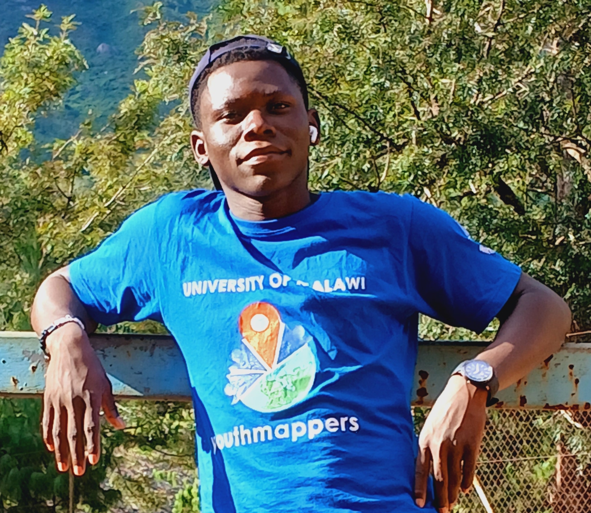
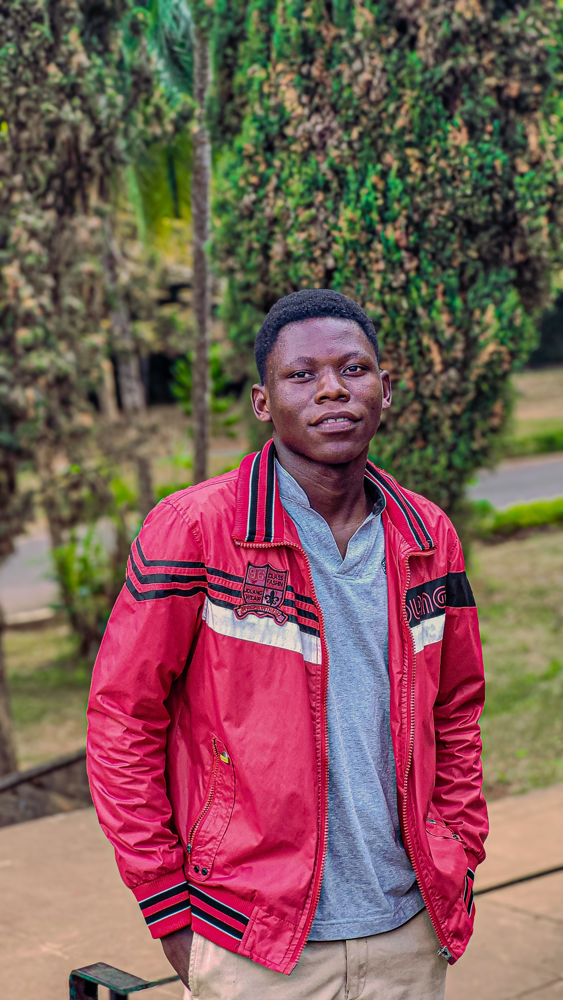

---
hide:
  - toc
  - navigation
---
<!--
CHECKLIST FOR THIS PAGE:
- [ ] Replace [YOUR NAME] with your full name (3 places)
- [ ] Replace [YOUR JOB TITLE] with your current or target role
- [ ] Replace [YOUR TAGLINE] with a short phrase describing your focus
- [ ] Rewrite the About Me paragraph with your own words
- [ ] Replace assets/images/profile.png with your actual photo (keep the filename or update it below)
- [ ] Replace assets/images/about.png with your own image (a field photo, map, or workspace shot)
- [ ] Edit the skill cards to match your actual skills (add, remove, or rename cards as needed)
- [ ] Update GitHub and LinkedIn links in the Connect section
- [ ] Add your CV PDF to docs/assets/ and update the filename in the Download CV button
-->

  
  <h1>Maclean Nyasulu</h1>
  
<strong>Geospatial Analyst | GIS & Remote Sensing Specialist </strong>

  
<em>Turning spatial data into insights for people, place and the environment</em>

---

## About Me

I am a geospatial analyst and GIS & Remote Specialist with Bachelor of science Degree 
in Geography from University of Malawi,specializing in GIS, remote sensing, UAV/drone 
mapping, spatial analysis, land surveying and geospatial data collection

l transform location-based data into clear actionable insights that support better decisions in 
environmental management, urban planning, community development, humanitarian mapping and sustainable land management

My practical experience includes processing UAV imagery into orthomasaics, digital 
elevation models and point clouds, conducting GIS based spatial analysis, collecting 
and managing geocoded field data, performing GNSS/RTK land surveying. Am proficient in 
using GIS technical tools like QGIS, ArcMap, GEE and RStudio, webODM, ODK, kobotool box and arcgis survey123.

Beyond technical skills l bring experience in land surveying, humanitarian mapping, environmental monitoring, 
drone mapping and geospatial research combine with leadership experience through University of Malawi Youthmappers

I am curently open to opportunities in Geographic information system (GIS), geospatial analysis, 
remote sensing, UAV/drone mapping, land surveying, environmental monitoring and spatial data management. 
Am eager to collaborate with organisations, professionals and teams uisng geospatial technology to solve 
real world challenges.

  

---

[View My Projects :material-arrow-right:](projects/index.md){ .md-button .md-button--primary }
[Download CV :material-download:](assets/maclean-cv.pdf.pdf){ .md-button }

---

## Skills

-   :material-layers:{ .lg .middle } **GIS & Remote Sensing**

    ---

    - QGIS, ARCMAP, ArcGIS Pro, Google Earth Engine
    - GDAL / OGR, GRASS GIS
    - ARCGIS DASHBOARD, UMAP, CHATMAP
    - Multispectral and SAR image analysis

-   :material-star-four-points:{ .lg .middle } **Machine Learning & GeoAI**

    ---

    - Supervised classification — Random Forest
    - Deep learning for image segmentation
    - PyTorch,
    - Object detection in satellite imagery

-   :material-water:{ .lg .middle } **Hydrological Modelling**
    
    ---

    - HEC-RAS
    - Soil and Water Assessment Tool (SWAT)

-   :material-airplane:{ .lg .middle } **Drone / UAV Data Processing**

    ---

    - Mission planning and flight operations
    - Photogrammetry: webodm, Agisoft Metashape, OpenDroneMap
    - Point cloud processing: CloudCompare

-   :material-map:{ .lg .middle } **Land Surveying**
 
    ---
     
    - Cadastral surveying
    - Topographic surveying
    - Softwares (GNNS/RTK GPS RECEIVER, autocad, archicad)

---

## Connect

[GitHub](https://github.com/macleannyasulu/macleannyasulu.github.oi){ .md-button }
[LinkedIn](https://linkedin.com/in/maclean-nyasulu){ .md-button }
