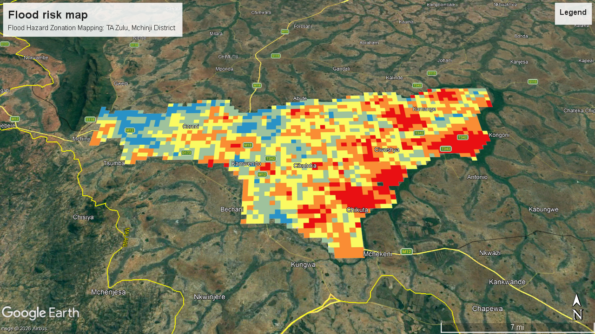

# Flood Hazard Zonation Mapping: TA Zulu, Mchinji District

![Flood hazard zonation map of TA Zulu, Mchinji District] 

## Overview

A flood hazard zonation map for Traditional Authority (TA) Zulu in Mchinji District, Malawi, built by combining 12 susceptibility and vulnerability parameters using the Analytical Hierarchy Process (AHP) and Weighted Linear Combination. The map shows local authorities where flooding is most likely and where communities are most exposed, in five hazard classes from Very Low to Very High.

**Study Area:** TA Zulu, Mchinji District, Malawi  
**Duration:** 1 month project (submitted 15 May 2026)  
**Role:** Data analyst in a six-person group (GEO 426 Integrated GIS and Remote Sensing mini project); carried out the spatial analysis from data assembly to the final map  
**Status:** Completed

---

## Methods & Tools

**Data Sources**

- Digital Elevation Model (DEM), USGS EarthExplorer <!-- TODO: add DEM product name and resolution -->
- Landsat 8 imagery (used for NDVI and mNDWI), Google Earth Engine <!-- TODO: add scene dates -->
- Lithology, FAO
- Population data (total population and density), Malawi National Statistical Office data portal
- Roads, hospitals and flood shelters, Humanitarian Data Exchange (HDX)

**Processing Steps**

1. **Assemble and project data:** Collected all datasets and projected them to WGS 1984 UTM Zone 36S.
2. **Derive the 12 parameters:** Six susceptibility factors (elevation, slope, NDVI, mNDWI, drainage density, lithology) and six vulnerability factors (total population, population density, distance to flood shelter, distance to hospital, distance to road, road density). Drainage density was calculated from the DEM using built-in ArcGIS tools (hydrological tool and line density).
3. **Reclassify:** Rescaled every parameter to a 1–5 ordinal scale (Very Low to Very High influence) using Jenks natural breaks.
4. **Weight with AHP:** Built pairwise comparison matrices in Excel to derive parameter weights, keeping the consistency ratio below 0.10 for every matrix.
5. **Calculate indices:** Combined the weighted layers into a Flood Susceptibility Index (FSI) and a Flood Vulnerability Index (FVI) using Weighted Linear Combination.
6. **Produce the hazard zones:** Combined the two indices with equal weighting, **FHZ = 0.5 × FSI + 0.5 × FVI**, and classified the result into five hazard zones.
7. **Export and check:** Exported the map as KML and viewed it in Google Earth Pro against the terrain to compare the risk classes with conditions on the ground.

**AHP Weights (%)**

| Susceptibility parameter | Weight | Vulnerability parameter | Weight |
|--------------------------|--------|-------------------------|--------|
| Elevation | 25.20 | Total population | 25.00 |
| Slope | 22.01 | Population density | 25.00 |
| Drainage density | 20.00 | Distance to flood shelter | 13.75 |
| Lithology | 13.00 | Distance to hospital | 13.25 |
| mNDWI (Landsat 8) | 9.91 | Distance to road | 11.50 |
| NDVI (Landsat 8) | 9.88 | Road density | 11.50 |

**Tools Used**

| Tool | Purpose |
|------|---------|
| ArcMap 10.8 | Spatial analysis, reclassification, weighted overlay, drainage density and final map layouts |
| Microsoft Excel | AHP pairwise comparison matrices and consistency checks |
| Google Earth Engine | Retrieving Landsat 8 imagery for NDVI and mNDWI |
| USGS EarthExplorer | Downloading the DEM |
| Google Earth Pro | Viewing the KML output against terrain to check the hazard classes |

---

## Key Findings

- The final map has five hazard classes (Very Low, Low, Medium, High, Very High), produced from an equal 50:50 weighting of landscape susceptibility and social vulnerability.
- High-risk zones are concentrated along drainage corridors in the western lowlands of TA Zulu.
- Elevation (25.2%), slope (22.01%) and drainage density (20%) carried the most weight in flood susceptibility, while total population and population density (25% each) carried the most in vulnerability.
- All AHP matrices passed the consistency check (CR below 0.10).
- The output was delivered as a KML file so local authorities can view it easily and the classes were checked visually against terrain in Google Earth Pro.

- flood vulnerability and flood susceptibility map ([pdf](<remote sensing FLOOD VULNERA AND SUSCEP.pdf>))

<!--
## Links

- [Project report](#)
- [KML file]
- [Code / repository](#)
-->